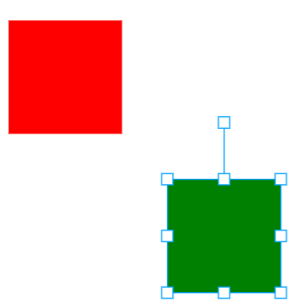

# React Konva

React Konva is a JavaScript library for drawing complex canvas graphics using [React](https://reactjs.org/)

# picture Demo

**How to resize and rotate canvas shapes with react-konva ?**

[Documentation](https://konvajs.org/docs/react/Transformer.html)